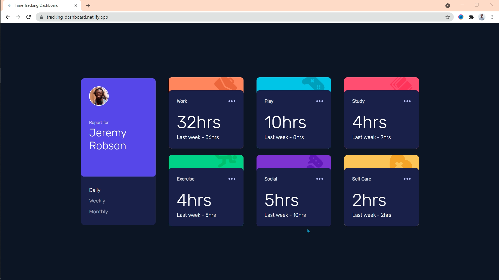

# Frontend Mentor - Time tracking dashboard solution

This is a solution to the [Time tracking dashboard challenge on Frontend Mentor](https://www.frontendmentor.io/challenges/time-tracking-dashboard-UIQ7167Jw). Frontend Mentor challenges help you improve your coding skills by building realistic projects. 

## Table of contents

- [Overview](#overview)
  - [The challenge](#the-challenge)
  - [Screenshot](#screenshot)
  - [Links](#links)
- [My process](#my-process)
  - [Built with](#built-with)
  - [What I learned](#what-i-learned)
  - [Continued development](#continued-development)
  - [Useful resources](#useful-resources)
- [Author](#author)
- [Acknowledgments](#acknowledgments)


## Overview

### The challenge

Users should be able to:

- View the optimal layout for the site depending on their device's screen size
- See hover states for all interactive elements on the page
- Switch between viewing Daily, Weekly, and Monthly stats

### Screenshot



**Screenshot of the Desktop Version Completed**

### Links

- Solution URL: [Time-tracking-dashboard](https://tracking-dashboard.netlify.app/)
- Live Site URL: [Time-tracking-dashboard](https://tracking-dashboard.netlify.app/)

## My process

### Built with

- Semantic HTML5 markup
- Flexbox
- CSS Grid
- Mobile-first workflow

## How to  run it locally
- Fork the repo
- Clone the repo
- Run this command on the terminal
```git
git clone (URL of cloned repo)
```
- Play around with the code 🔥🔥🔥🔥


### What I learned

### Git commands I learnt through out the process

```git
git log
```
```git
git -D branch newBranchname
```
```git
git checkout branchname
```
```git
git merge branchname
```
```git
git push origin -u branchname
```
```git
git push origin -delete branchname
```
```git
git branch -d branchname
```
```git
git commit -m "commit message"
```
```git
git push origin -u remotebranchname
```
```git
git pull
```

### Continued development

I will focused on learning CSS Grid later after the project completion. I was finding it difficult making the design responsive on mobile with flex-box;


### Useful resources

- [Github Documentation](https://docs.github.com/en) - This helped me for understanding github. I really liked this documentations, it very beginner friendly and I use it a lot.
- [Freecodecamp](https://www.freecodecamp.org/news/how-to-delete-a-git-branch-both-locally-and-remotely/) - This is an amazing article which helped me finally understand how to delete branch both locally and remotely. I'd recommend it to anyone still learning Git and Github.
- If you want more help with writing markdown, I recommend checking out [The Markdown Guide](https://www.markdownguide.org/) to learn more.


## Author

- Frontend Mentor - [@Nakamcode](https://www.frontendmentor.io/profile/Nakamcode)
- Twitter - [@nakam360](https://www.twitter.com/nakam360)
- Linkedin - [Nana Asamoah Kwaw](https://www.linkedin.com/in/nana-asamoah-kwaw-09a27b212)


## Acknowledgments

I acknowledge [@RaiqaRasool](https://github.com/RaiqaRasool) for the daily motivation and inspiration;✨✨✨✨ I'm also grateful for all the bug hunting and solutions
**Checkout** [@RaiqaRasool](https://github.com/RaiqaRasool) **version of the challenge**  [Time-tracking-dashboard](https://raiqarasool.github.io/Time-Tracking-Dashboard/)
